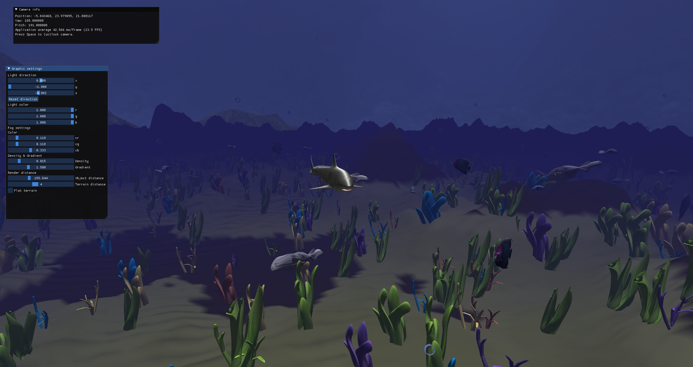

# Symulator oceanu

## Zespół

- Jakub Klupieć (452701)
- Magdalena Romul (452656)
- Aleksander Piaskowski (452643)

## Features

- pływające ryby
- skybox (cubemaps)
- sterowanie rekinem
- ukształtowanie terenu
- oświetlenie
- mgła
- joint-based movement (rekin, prędkość animacji zależna od szybkości poruszania)
- nieskończone generowanie terenu (perlin noise, wielowątkowość)
- billboarding (bąbelki powietrza)
- autorskie modele ryb i roślin
- ustawienia graficzne za pomocą GUI
- użyty Entity Component System (zwiększa wydajność)
- zaimplementowany sprite batching (nie jest użyty w projekcie)

  
## Efekt końcowy


Parametry terenu w chunk_generator.h
```cpp
constexpr static const float MESH_HEIGHT = 24;
constexpr static const float NOISE_SCALE = 64;
constexpr static const float PERSISTENCE = 0.5;
constexpr static const float LACUNARITY = 2;
constexpr static const float GROUND_HEIGHT = 0.1;
static const int OCTAVES = 7;
```